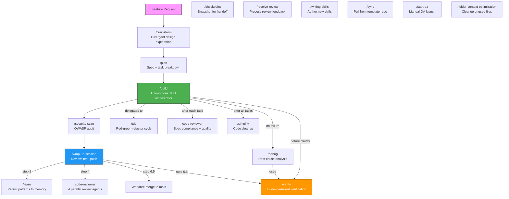

# Coding Agent Workflow

A reusable, project-agnostic configuration system that enforces **spec-driven, TDD-first development** across all your projects — with persistent memory, specialized agents, and a structured session lifecycle. Works with Claude Code, Cursor, and other AI coding tools.

---

## What's Included

| Layer | What it does |
|-------|-------------|
| **CLAUDE.md** | Core rules: Spec → Plan → TDD workflow, Clean Code, SOLID, quality gate |
| **Skills** (`.claude/skills/`) | 16 skills: `/brainstorm`, `/plan`, `/build`, `/tdd`, `/debug`, `/verify`, `/simplify`, `/receive-review`, `/learn`, `/checkpoint`, `/security-scan`, `/start-qa`, `/wrap-up-session`, `/writing-skills`, `/sync`, `/folder-context-optimization` |
| **Agents** (`.claude/agents/`) | 8 specialized subagents for planning, coding, review, debugging, security |
| **Hooks** (`.claude/hooks/`) | Session start orientation + auto test runner on file save |
| **Memory** (`.claude/memory.md`) | Persistent patterns and session history, updated via `/learn` |

---

## Using This as Your Default for Every Project

Run `install.sh` once. It sets up three layers of enforcement that activate automatically for every future project.

### Step 1 — Clone and install

```bash
git clone <this-repo-url> ~/coding-agent-workflow
cd ~/coding-agent-workflow
bash install.sh
```

Then paste the printed `newproject()` function into your `~/.bashrc` or `~/.zshrc`:

```bash
source ~/.bashrc   # or source ~/.zshrc
```

### Step 2 — Start every new project with

```bash
newproject my-app
cd my-app
claude
```

That's it. Claude is fully oriented from the first message.

---

## What `install.sh` Does

### Layer 1 — Global Claude config (`~/.claude/`)

Copies your skills, agents, and CLAUDE.md into `~/.claude/`. Claude Code reads this directory for **every session in every project** — no per-project setup needed.

```
~/.claude/
├── CLAUDE.md          ← global rules (applies everywhere)
├── skills/            ← all skills available in every project
├── agents/            ← all agents available in every project
├── hooks/
│   └── session-start.sh
└── settings.json      ← registers the SessionStart hook globally
```

The **SessionStart hook** runs automatically at the start of every Claude Code session. It prints:
- Active patterns and lessons from `.claude/memory.md`
- Pending and in-progress tasks from `tasks/todo.md`
- Recent lessons from `tasks/lessons.md`
- Current git branch and uncommitted change count

### Layer 2 — Git template directory (`~/.git-templates/`)

Sets `git config --global init.templateDir ~/.git-templates`. Every time you run `git init`, a `post-init` hook fires and copies this scaffold into the new repo (only if files don't already exist):

```
tasks/todo.md       ← active task plan
tasks/bugs.md       ← bug register
tasks/lessons.md    ← session lessons
specs/              ← feature specification directory
CLAUDE.md           ← project-specific overrides
```

### Layer 3 — `newproject` shell function

```bash
newproject() {
  local name="${1:?Usage: newproject <project-name>}"
  mkdir -p "$name" && cd "$name"
  git init                        # triggers post-init hook → copies Claude scaffold
  echo "# $name" > README.md
  git add . && git commit -m "chore: init project with Claude workflow scaffold"
}
```

Wraps `git init` (which triggers layer 2) and makes an initial commit. One command from zero to a fully scaffolded, Claude-ready project.

---

## Keeping It Up to Date

Re-running `install.sh` is safe — it overwrites `~/.claude/` with the latest version:

```bash
cd ~/coding-agent-workflow
git pull
bash install.sh
```

---

## Adding to an Existing Project

No need to use `newproject`. Just copy the scaffold files manually:

```bash
cp ~/coding-agent-workflow/project-template/tasks/todo.md tasks/
cp ~/coding-agent-workflow/project-template/tasks/bugs.md tasks/
cp ~/coding-agent-workflow/project-template/tasks/lessons.md tasks/
cp ~/coding-agent-workflow/project-template/CLAUDE.md .
mkdir -p specs
```

Then edit `CLAUDE.md` to fill in your project's stack and test commands.

---

## Session Workflow

```
Feature Request
    │
    ▼
/brainstorm ──► explore options → multi-option proposals → design approval
    │
    ▼
/plan ──► interviews you → writes spec → task list in tasks/todo.md
    │
    ▼  (confirm with 'y')
/build ──► autonomous TDD + sub-agents → 2-stage review → simplify → spec validation
    │
    ▼  (all tasks done)
/security-scan ──► audit changed files for OWASP issues
    │
    ▼
/wrap-up-session ──► verify → code review → sync learnings → merge worktree → push
```

---

## Skill Interdependency



**Core workflow** (top row): brainstorm → plan → build → security-scan → wrap-up-session

**Internal calls**: /build delegates to sub-agents for TDD, invokes code-reviewer for 2-stage review, /debug on failures, /simplify after all tasks, and /verify before any completion claims.

**Standalone skills** (bottom): Can be invoked independently at any time.

---

## Skills

Invoke with `/skill-name` in any Claude Code session:

| Skill | What It Does |
|-------|-------------|
| `/brainstorm` | Divergent design exploration: 2-3 approaches with trade-offs, design approval before `/plan` |
| `/plan` | Interviews you, writes spec to `specs/`, creates TDD task plan in `tasks/todo.md` |
| `/build` | Autonomous orchestrator: TDD + sub-agents + 2-stage review + parallel dispatch + simplify + spec validation |
| `/tdd` | Manual TDD loop with user checkpoints: failing test → code → pass → refactor → `[x]` |
| `/debug` | Root cause analysis with architecture questioning after 3 fails, bug register, lessons |
| `/verify` | Evidence-based verification gate — no completion claims without fresh command output |
| `/simplify` | Review changed code for reuse, quality, complexity; fix issues found |
| `/receive-review` | Process code review feedback: technical evaluation, pushback protocol, no performative agreement |
| `/learn` | Extracts session patterns and appends them to `.claude/memory.md` |
| `/checkpoint` | Saves progress snapshot to `tasks/checkpoint.md` for handoff or pause |
| `/security-scan` | Audits changed files against OWASP top 10; blocks commit on HIGH/MEDIUM |
| `/start-qa` | Discover project config, restart app, launch browser, background smoke tests |
| `/wrap-up-session` | Parallel code review → verify → merge worktree → sync learnings → run tests → push |
| `/writing-skills` | Author new skills with proper structure, iron laws, and reference docs |
| `/sync` | Pull latest skills, hooks, agents from template repo into current project |
| `/folder-context-optimization` | Sweep a folder for legacy/unused files, propose archival |

---

## Philosophy

This workflow is built on patterns that prevent common AI agent failure modes:

**Iron Laws** — Non-negotiable rules that the agent cannot rationalize away. Each critical skill has one:
- TDD: "No production code without a failing test first"
- Debug: "No fixes without root cause investigation first"
- Verify: "No completion claims without fresh verification evidence"

**Rationalization Tables** — Pre-addressed excuses. When the agent thinks "just this once" or "I'll test after", the skill already contains the rebuttal.

**Two-Stage Review** — Every task in `/build` passes through spec compliance review AND code quality review before proceeding.

**Evidence Over Claims** — The `/verify` skill bans phrases like "should work" or "looks correct". Only actual command output counts.

**Memory Across Sessions** — `.claude/memory.md` and `tasks/lessons.md` persist patterns so the agent doesn't repeat mistakes.

---

## Agents

Claude delegates to these automatically (or you can invoke them via the Agent tool):

| Agent | Best For |
|-------|---------|
| `planner` | Spec writing, task breakdown, architecture decisions |
| `backend-developer` | APIs, databases, auth, performance, security |
| `frontend-developer` | React/Vue/Angular components, responsive UI |
| `frontend-design-validator` | Verify UI matches design references |
| `code-reviewer` | Post-implementation quality review (invoked proactively) |
| `code-debugger` | Debugging failing tests and runtime errors |
| `security-reviewer` | OWASP checks, auth flows, injection vectors |
| `context-document-optimizer` | Compress large docs for token efficiency |

---

## Hooks

| Hook | Trigger | What It Does |
|------|---------|-------------|
| `session-start.sh` | Session start | Prints memory, active tasks, lessons, git status, available skills catalog |
| `auto-test-runner.sh` | After every Bash tool use | Runs tests on changed files; creates task entries on failure |

---

## Directory Structure

```
.
├── install.sh                       ← Run once to set up global Claude config
├── CLAUDE.md                        ← Core rules (copied to ~/.claude/CLAUDE.md)
├── project-template/                ← Scaffold copied into new projects
│   ├── CLAUDE.md                    ← Project-specific override template
│   └── tasks/
│       ├── todo.md
│       ├── bugs.md
│       └── lessons.md
├── .claude/
│   ├── AGENTS.md                    ← Agent reference documentation
│   ├── memory.md                    ← Persistent project memory (updated via /learn)
│   ├── settings.json                ← Hook configuration
│   ├── agents/                      ← 8 specialized subagents
│   ├── skills/                      ← 16 skills, each with SKILL.md + optional reference docs
│   └── hooks/
│       ├── session-start.sh         ← Orientation + skill awareness
│       └── auto-test-runner.sh
├── tasks/
│   ├── todo.md                      ← Active task plan
│   └── bugs.md                      ← Bug register
├── specs/                           ← Feature specifications
└── tests.md                         ← Project-specific test configuration
```

---

## Sources

- [shanraisshan/claude-code-best-practice](https://github.com/shanraisshan/claude-code-best-practice) — Command/agent/skill architecture
- [affaan-m/everything-claude-code](https://github.com/affaan-m/everything-claude-code) — Memory system, hook lifecycle, continuous learning
- [obra/superpowers](https://github.com/obra/superpowers) — Iron laws, verification patterns, brainstorming workflow, systematic debugging
